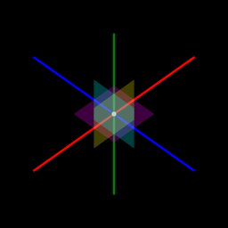

# Sost

> IPA: /sost/, Amharic: ሶስት, Definition: 'three'

Like the canvas, but in three dimensions

---

As of right now, Sost is still very much in the alpha stage of development.
You can track what needs to be done and what's getting done in [TODOS.md](TODOS.md).
This README will likely be updated as the project progresses to feature the latest developments.

## Building

This project, due to its alpha status, has not yet been pushed to the npm registry, so you'll need to build it from the source.
Unfortunately, there is no complete documentation for the package as internal structure is still rapidly changing.
This is currently a work in progress, so for now the guide presented [here](#guide) will have to suffice.

To start, clone the repo and install the required dependencies:

```sh
git clone https://github.com/quantum9innovation/sost
cd sost; npm install .
```

If you intend to work on a fork, installing the dev dependencies with `npm install --dev` will be quite helpful.
Additionally, if you plan on using Sost in native Node.js as opposed to in the browser, you'll need to install [`canvas`](https://www.npmjs.com/package/canvas) to create the initial 2D rendering context.

Sost is designed to work both in a native Node.js environment (through the `canvas` module) and in a browser environment (using Browserify and Terser).
To see some examples of Sost running in Node.js, simply run `npm test` from the project root and check [artifacts](./test/artifacts/) for the results.
For a more impressive demo, simply run `npm start`, which will launch [index.html](./index.html) in the browser, and then drag to rotate the view.

## Screenshots

If the tests work, you should see an image like the one below appear in the [artifacts](./test/artifacts/) directory.



*The x, y, and z axes displayed as red, blue, and green lines, respectively. In the center lies a white point demarcating the origin. The three planes intersecting that point trace out part of the xy, xz, and yz planes.*

## Guide

As the majority of time is being spent on development, this guide is quite brief and focused on the core functionality.
More details will be provided when formal documentation is available.

The first thing to do is to generate a 2D canvas. Even though Sost initializes its own canvas, it requires a base canvas to project the 3D objects onto. Sost works with both the `canvas` package in Node.js and an actual HTML5 canvas.

If you're using a browser, you'll need to load the browser-ready version of Sost from `dist/sost.min.js`, which is generated by `npm run build`.

Now, create the canvas and get its 2D rendering context to be passed into Sost:

```js
const canvas = ...
const ctx = canvas.getContext('2d')
```

In Sost, the canvas initializer is a function that takes a canvas context and three dimensional variables.
At this point, it's important to briefly outline the three main "spaces" in which Sost operates.
The first and most basic of which is the pixel space, which deals with actual 2D coordinates on the `ctx` variable.
The second is known as "point space," because it is a user-defined 3D space, which Sost uses to project objects onto 2D pixel space.
Point space is defined by three dimensions: width, height, and depth, which in turn tells Sost how to scale the objects it draws in 3D space onto the 2D canvas.
The middle of the canvas represents the origin of the point space, that is the point $(0, 0, 0)$.

At this point you may be wondering what the third space is.
The third space is essentially the same as point space, except that it can be scaled and rotated in three dimensions.
This space is known as the Cartesian space.
In essence, every point that you tell Sost to draw in Cartesian space goes through two transformations before it is eventually drawn onto the Canvas. The first transformation transforms Cartesian space into point space, and the second transforms point space to pixel space.
Point space, in this sense, acts as a static intermediary between Cartesian and pixel space.
Objects drawn in point space won't rotate, scale, or otherwise change while those in Cartesian space will.
Most high-level objects in Sost are drawn in Cartesian space, while lower-level, more primitive objects are drawn in point space.
By default, point space has a scaling factor of 1, making it the same size as Cartesian space, and a perspective parallel to the xz plane.

To create a 3D canvas, we need to use the `Canvas3D` method and pass in the dimensions of our point space in the order of width, height, and depth.
For example, if we wanted to create a canvas defined by a cube with side length 2 centered at the origin, we would use:

```js
const three = new sost.Canvas3D(ctx, 2, 2, 2)
```

The eight corners of this cube are given by the vertices $(\pm 1, \pm 1, \pm 1)$, with the center at the origin $(0, 0, 0)$.

We can set an initial perspective for our Cartesian space by accessing the built-in Camera object.
Perspectives are passed in as an array of two angles, the first representing rotation over the xy plane ($\theta$) and the second representing rotation over the yz plane ($\phi$).
Scaling can be adjusted as well by accessing the `zoom` property.
Translating the origin can be achieved by setting the `center` property to the new origin coordinates.

Let's set a perspective of $(\theta, \phi) = (\frac{\pi}{4}, \frac{\pi}{4} )$.

```js
three.Camera.angle = [Math.PI / 4, Math.PI / 4]
```

Sost currently supports three types of objects: points, lines, and polygons.
Points are drawn as a circle centered at the point's coordinates with a radius equal to `three.pointSize` and color `three.pointStyle`.
Lines are drawn between a pair of provided coordinates with thickness `three.lineWidth` and color `three.strokeStyle`.
Polygons are drawn between three or more coordinates with color `three.fillStyle`.
Stroke/fill modes can be selectively enabled or disabled for polygons by switching the `three.fill` and `three.stroke` properties.

Let's start by drawing the three axes of our point space.

```js
// Draw the x axis in red
three.strokeStyle = 'red'
three.line([-1, 0, 0], [1, 0, 0])

// Draw the y axis in blue
three.strokeStyle = 'blue'
three.line([0, -1, 0], [0, 1, 0])

// Draw the z axis in green
three.strokeStyle = 'green'
three.line([0, 0, -1], [0, 0, 1])
```

We can also plot the origin in white:

```js
three.pointSize = 5
three.pointStyle = 'white'
three.point([0, 0, 0])
```

Lastly, we'll make use of the `polygon` method to draw the xy, xz, and yz planes.

```js
// Define plane endpoints as coordinate arrays
const XY = [
  [-0.25, -0.25, 0], 
  [-0.25, 0.25, 0], 
  [0.25, 0.25, 0], 
  [0.25, -0.25, 0]
]
const XZ = [
  [-0.25, 0, -0.25], 
  [-0.25, 0, 0.25], 
  [0.25, 0, 0.25], 
  [0.25, 0, -0.25]
]
const YZ = [
  [0, -0.25, -0.25], 
  [0, -0.25, 0.25], 
  [0, 0.25, 0.25], 
  [0, 0.25, -0.25]
]


// Draw the xy plane in translucent purple
three.fillStyle = 'rgba(255, 0, 255, 0.25)'
three.polygon(XY)

// Draw the xz plane in translucent yellow
three.fillStyle = 'rgba(255, 255, 0, 0.25)'
three.polygon(XZ)

// Draw the yz plane in translucent teal
three.fillStyle = 'rgba(0, 255, 255, 0.25)'
three.polygon(YZ)
```

Viola!
We get the output generated by our testing suite.
For comparison, see the [artifacts](./test/artifacts/base.png) directory.

As a more advanced sidenote, the `point`, `line`, and `polygon` methods have primitive equivalents (which operate in point space rather than Cartesian space) given by appending a `p_` prefix to each of their names: `p_point`, `p_line`, and `p_polygon`.
There's also a `clear` method, which completely clears all data drawn to the canvas, and is useful when you want to change perspective and need Sost to redraw the scene.

## Future Work

Sost is very much still a work in progress and there is lots to be done.
If you want to help out, it is highly recommended that you fork the repository and view the [TODOS](./TODOS.md) as well as any open issues for work that you can help with.
